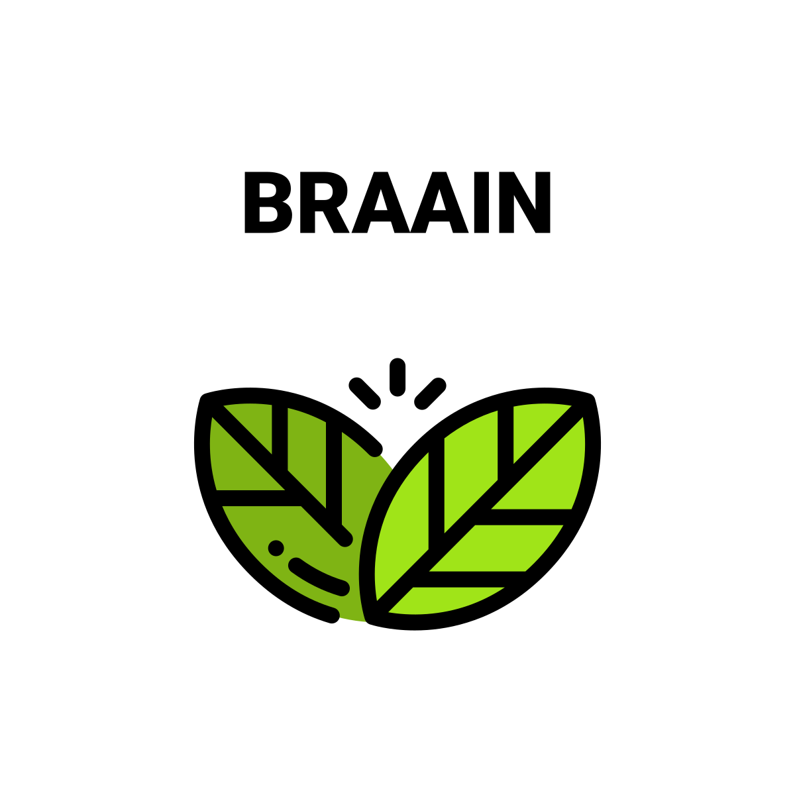

   

  

## 🌐 Building Resilience & Accountability in AI for Education
  
  *A research project funded by [EPSRC](https://epsrc.ukri.org/) and [AISI](https://www.aisi.gov.uk/)*  
<!--  
   -->

---

## 🎯 Overview
**Investigating trustworthy AI systems for education** through resilience enhancement against adversarial attacks, biases, and environmental uncertainties while ensuring transparent decision-making.

### Key Objectives
✔ **Robustness**: Improve AI reliability in dynamic educational environments  
✔ **Accountability**: Develop transparent decision-logging frameworks  
✔ **Impact**: Test systems in real-world skill development scenarios  

**Focus Areas**:  
🔹 AI Safety & Security  
🔹 Ethical Compliance  
🔹 Accessibility in EdTech  

---

## 🧠 Methodology
### Technical Approach
| Component | Tools/Techniques |
|-----------|------------------|
| **Adversarial Training** | Stress-testing AI models |
| **Explainability** | SHAP, LIME, Custom Modules |
| **Evaluation** | Controlled educational experiments |

## 👥 Research Team

**Lead Investigator**: [Dr. Farhana Ferdousi Liza](https://research-portal.uea.ac.uk/en/persons/farhana-ferdousi-liza-fhea) (*University of East Anglia, UK.*)  (AI Safety and Security)  
**Co-Lead Investigator**:  
- [Dr. Shoaib Ahmed](https://profiles.sussex.ac.uk/p590456-shoaib-ahmed/professional) (Ethics and Accountability)  
- [Dr. Katherine Deane](https://research-portal.uea.ac.uk/en/persons/katherine-deane) (Accessibility)  

## 🤝 Partners & Funding

  &nbsp;&nbsp;&nbsp;  

Grant Support: EPSRC/AISI Grant #YYYYY

## 💬 Get Involved
We welcome collaborations from researchers and educators!

📧 Contact: f.liza@uea.ac.uk
📢 Follow: @ProjectTwitterHandle

Would you be interested in contributing? Open an issue or reach out via email!

## 📜 License

This project is licensed under the MIT License - see the LICENSE file for details.

 Built with ❤️ by the Responsible AI Education Team 
 

